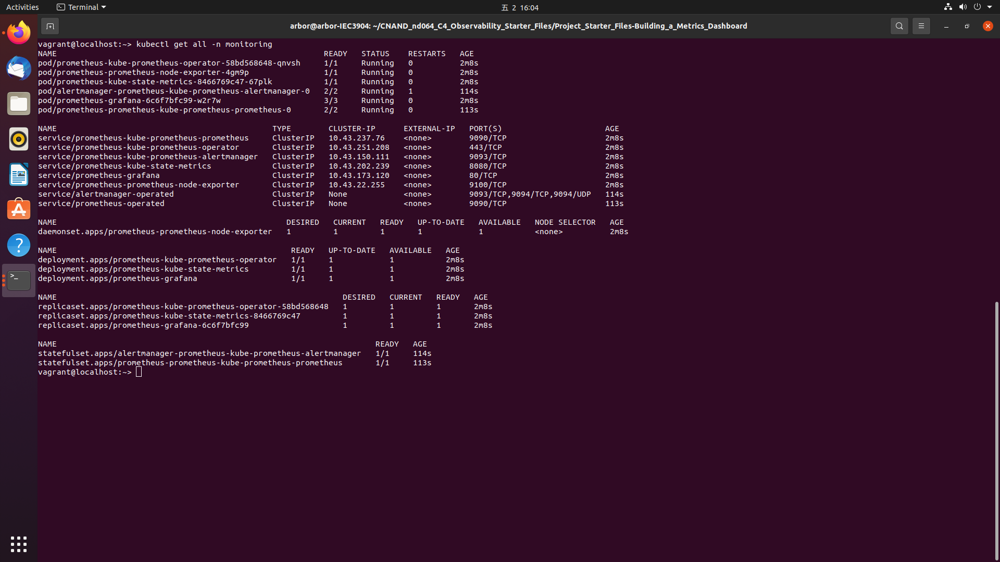
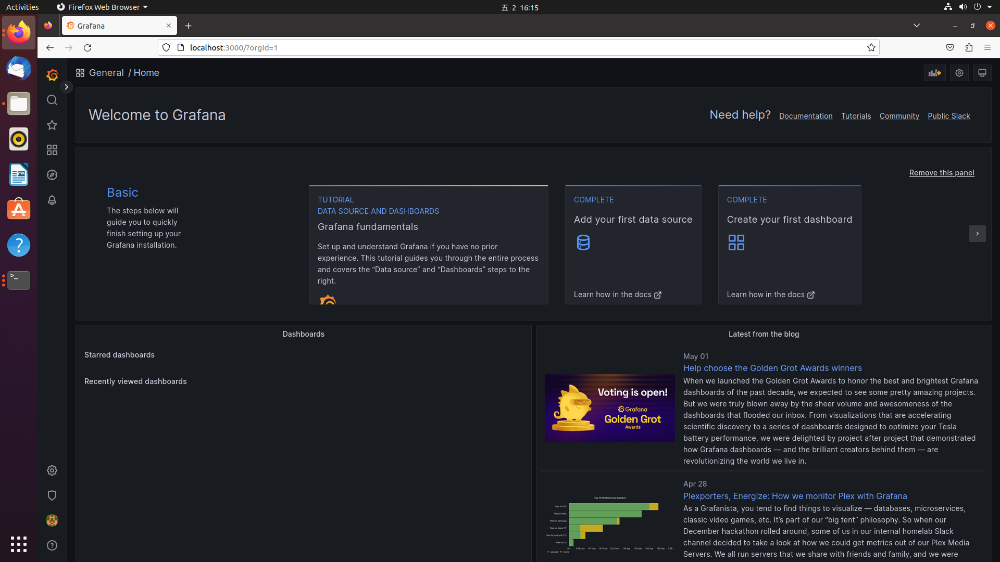
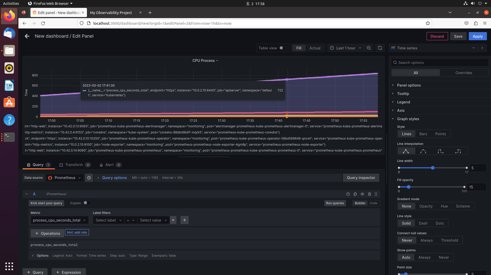

# cn-metrics-dashboard
Using Prometheus, Jaeger, and Grafana to monitor, trace and visualize the application that is deployed on a Kubernetes cluster.

## Prerequisites

Have vagrant up. Destory existing VM if necessary.
```
$ vagrant halt
$ vagrant destroy
$ vagrant global-status
$ vagrant destroy $(vm id)
$ vagrant ssh
```

Bring up Helm. Install Prometheus and Jaeger.
```
$ curl https://raw.githubusercontent.com/helm/helm/master/scripts/get-helm-3 | bash

$ kubectl create namespace monitoring
$ helm repo add prometheus-community https://prometheus-community.github.io/helm-charts
$ helm repo add stable https://charts.helm.sh/stable
$ helm repo update
$ helm install prometheus prometheus-community/kube-prometheus-stack --namespace monitoring --kubeconfig /etc/rancher/k3s/k3s.yaml

$ kubectl --namespace monitoring get pods -l "release=prometheus"


$ kubectl create namespace observability
$ export jaeger_version=v1.28.0

$ kubectl create -n observability -f https://raw.githubusercontent.com/jaegertracing/jaeger-operator/${jaeger_version}/deploy/crds/jaegertracing.io_jaegers_crd.yaml
$ kubectl create -n observability -f https://raw.githubusercontent.com/jaegertracing/jaeger-operator/${jaeger_version}/deploy/service_account.yaml
$ kubectl create -n observability -f https://raw.githubusercontent.com/jaegertracing/jaeger-operator/${jaeger_version}/deploy/role.yaml
$ kubectl create -n observability -f https://raw.githubusercontent.com/jaegertracing/jaeger-operator/${jaeger_version}/deploy/role_binding.yaml
$ kubectl create -n observability -f https://raw.githubusercontent.com/jaegertracing/jaeger-operator/${jaeger_version}/deploy/operator.yaml

$ kubectl create -f https://raw.githubusercontent.com/jaegertracing/jaeger-operator/${jaeger_version}/deploy/cluster_role.yaml
$ kubectl create -f https://raw.githubusercontent.com/jaegertracing/jaeger-operator/${jaeger_version}/deploy/cluster_role_binding.yaml

$ kubectl apply -f https://raw.githubusercontent.com/kubernetes/ingress-nginx/controller-v1.0.3/deploy/static/provider/cloud/deploy.yaml

$ kubectl get svc -n observability
$ kubectl get deploy

```

## Verify the monitoring installation

Run the following kubectl command to show the running pods and services for all components. 
```
$ kubectl get all -n monitoring
```



## Setup the Jaeger and Prometheus source

Expose Grafana to the internet and then setup Prometheus as a data source.
```
$ kubectl port-forward -n monitoring svc/prometheus-grafana --address 0.0.0.0 3000:80
```



## Create a Basic Dashboard



See attached.

## Creating SLI metrics.

SLIs (Service Level Indicators) are metrics that are used to measure the performance of a service. In the context of an SLO for monthly uptime and request response time, SLIs would be the specific metrics that are used to measure these two aspects of service performance.

For example, an SLI for monthly uptime could be the percentage of time that the service is available in a given month. This could be measured by monitoring the service and recording the amount of time that it is up and running versus the amount of time that it is down or unavailable.

Similarly, an SLI for request response time could be the average amount of time it takes for the service to respond to a request. This could be measured by monitoring the service and recording the amount of time it takes to respond to each request, then calculating the average response time.

By tracking these SLIs, we can get a better understanding of how well your service is performing in terms of uptime and response time, and use this information to set SLOs, or Service Level Objectives, for these metrics. SLOs are specific targets that you set for your SLIs, and they help you ensure that your service is meeting the performance standards that you need to meet your business goals.

For example, you might set an SLO for monthly uptime of 99.9%, which means that you want your service to be available for at least 99.9% of the time in a given month. You might also set an SLO for request response time of 200 milliseconds, which means that you want your service to respond to requests in no more than 200 milliseconds on average.

Concretely, we can address as following:
- Monthly Uptime:
  -	SLO: The service uptime for May. 2023, should not be less than 99.99%.
  -	SLI: The service uptime is 99.99% active in May. 2023.

- Request Response Time:
  -	SLO: Th average request response time shall be less than 200 milliseconds during June. 2023.
  -	SLI: The average request response time is 200 milliseconds in April. 2023.


## Creating SLI metrics.

1. **Latency**: The time it takes for a request to be processed and a response to be returned. It is a critical metric for applications that require fast response times, such as real-time data processing or online gaming.

2. **Error rate**: This metric measures the percentage of requests that result in errors. It is important to track this metric to ensure that errors are caught and addressed before they impact users.

3. **Throughput**: It is the number of requests that can be processed by the application in a given time period. It is necessary to track this metric to ensure that the application can handle the expected load.

4. **Availability**: It is an index to measure the percentage of time that the application is available and functioning properly. It is essential to track this metric to ensure that the application is meeting its uptime requirements.

5. **Resource utilization**: To measure the amount of resources, such as CPU, memory, and disk space, that the application is using. The purpose is to ensure that the application is not overloading the system and causing performance issues.

By tracking these metrics, you can get a better understanding of how well your application is performing and identify areas for improvement. Do you have any questions about these metrics or how they are used to measure SLIs?
