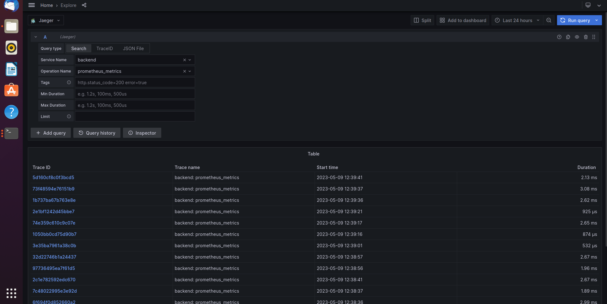

# cn-metrics-dashboard
Using Prometheus, Jaeger, and Grafana to monitor, trace and visualize the application that is deployed on a Kubernetes cluster.

## Prerequisites

Open a terminal (T1). Have vagrant up. Destory existing VM if necessary.
```
$ vagrant halt
$ vagrant destroy
$ vagrant global-status
$ vagrant destroy $(vm id)
$ vagrant ssh
```

Bring up Helm. Install Prometheus and Jaeger.
```
$ curl https://raw.githubusercontent.com/helm/helm/master/scripts/get-helm-3 | bash

$ kubectl create namespace monitoring
$ helm repo add prometheus-community https://prometheus-community.github.io/helm-charts
$ helm repo add stable https://charts.helm.sh/stable
$ helm repo update
$ helm install prometheus prometheus-community/kube-prometheus-stack --namespace monitoring --kubeconfig /etc/rancher/k3s/k3s.yaml

$ kubectl --namespace monitoring get pods -l "release=prometheus"


$ kubectl create namespace observability
$ export jaeger_version=v1.28.0

$ kubectl create -n observability -f https://raw.githubusercontent.com/jaegertracing/jaeger-operator/${jaeger_version}/deploy/crds/jaegertracing.io_jaegers_crd.yaml
$ kubectl create -n observability -f https://raw.githubusercontent.com/jaegertracing/jaeger-operator/${jaeger_version}/deploy/service_account.yaml
$ kubectl create -n observability -f https://raw.githubusercontent.com/jaegertracing/jaeger-operator/${jaeger_version}/deploy/role.yaml
$ kubectl create -n observability -f https://raw.githubusercontent.com/jaegertracing/jaeger-operator/${jaeger_version}/deploy/role_binding.yaml
$ kubectl create -n observability -f https://raw.githubusercontent.com/jaegertracing/jaeger-operator/${jaeger_version}/deploy/operator.yaml

$ kubectl create -f https://raw.githubusercontent.com/jaegertracing/jaeger-operator/${jaeger_version}/deploy/cluster_role.yaml
$ kubectl create -f https://raw.githubusercontent.com/jaegertracing/jaeger-operator/${jaeger_version}/deploy/cluster_role_binding.yaml

$ kubectl apply -f https://raw.githubusercontent.com/kubernetes/ingress-nginx/controller-v1.0.3/deploy/static/provider/cloud/deploy.yaml

$ kubectl get svc -n observability
$ kubectl get deploy
```

Open another terminal (T2). Securely copy the K8s manifest config files to the VM. Deploy the service.
```
$ cd cn-metrics-dashboard/manifests/app
$ vagrant plugin install vagrant-scp
$ vagrant scp backend.yaml backend.yaml
$ vagrant scp frontend.yaml frontend.yaml
$ vagrant scp jaeger-instance.yaml jaeger-instance.yaml

$ vagrant ssh
$ kubectl apply -f backend.yaml
$ kubectl apply -f frontend.yaml
$ kubectl apply -f jaeger-instance.yaml
```

Once it's done, check all the deployments, services are running.
```
$ kubectl get deploy -n monitoring
$ kubectl get deploy -n observability
$ kubectl get svc -n observability
$ kubectl get deploy
```

We should be able to retrieve the information printed out in the console. 
```
NAME                                  READY   UP-TO-DATE   AVAILABLE   AGE
prometheus-kube-state-metrics         1/1     1            1           5m25s
prometheus-kube-prometheus-operator   1/1     1            1           5m25s
prometheus-grafana                    1/1     1            1           5m25s
vagrant@localhost:~> kubectl get deploy -n observability
NAME              READY   UP-TO-DATE   AVAILABLE   AGE
jaeger-operator   1/1     1            1           4m23s
cn-traces         1/1     1            1           113s
vagrant@localhost:~> kubectl get svc -n observability
NAME                           TYPE        CLUSTER-IP      EXTERNAL-IP   PORT(S)                                  AGE
jaeger-operator-metrics        ClusterIP   10.43.237.44    <none>        8383/TCP,8686/TCP                        3m27s
cn-traces-collector-headless   ClusterIP   None            <none>        9411/TCP,14250/TCP,14267/TCP,14268/TCP   2m2s
cn-traces-collector            ClusterIP   10.43.79.0      <none>        9411/TCP,14250/TCP,14267/TCP,14268/TCP   2m2s
cn-traces-query                ClusterIP   10.43.139.171   <none>        16686/TCP,16685/TCP                      2m2s
cn-traces-agent                ClusterIP   None            <none>        5775/UDP,5778/TCP,6831/UDP,6832/UDP      2m2s
vagrant@localhost:~> kubectl get deploy
NAME           READY   UP-TO-DATE   AVAILABLE   AGE
frontend-app   3/3     3            3           2m23s
backend-app    3/3     3            3           2m26s
```

OK! All done. Let's start to use Prometheus, Grafana, and Jaeger.

In terminal 1, type below command to port forward prometheus-grafana service.

```
$ kubectl port-forward -n monitoring svc/prometheus-grafana --address 0.0.0.0 3000:80
```

Open the browser and type in `127.0.0.1:3000` to actually see the dashboard. Note that the default username and password is `admin` and `prom-operator` separately.

Keep going to port forward jaeger tracing service in terminal 2. 
```
$ kubectl port-forward -n observability service/cn-traces-query --address 0.0.0.0 16686:16686
```

Open another window and input `127.0.0.1:8088` as URL to check Jaeger took effect.

## Verify the monitoring installation

Run the following kubectl command to show the running pods and services for all components. 
```
$ kubectl get all -n monitoring
```


## Setup the Jaeger and Prometheus source

Expose Grafana to the internet and then setup Prometheus as a data source.
```
$ kubectl port-forward -n monitoring svc/prometheus-grafana --address 0.0.0.0 3000:80
```


## Create a Basic Dashboard


See attached.

## Describe SLO/SLI

SLIs (Service Level Indicators) are metrics that are used to measure the performance of a service. In the context of an SLO for monthly uptime and request response time, SLIs would be the specific metrics that are used to measure these two aspects of service performance.

For example, an SLI for monthly uptime could be the percentage of time that the service is available in a given month. This could be measured by monitoring the service and recording the amount of time that it is up and running versus the amount of time that it is down or unavailable.

Similarly, an SLI for request response time could be the average amount of time it takes for the service to respond to a request. This could be measured by monitoring the service and recording the amount of time it takes to respond to each request, then calculating the average response time.

By tracking these SLIs, we can get a better understanding of how well your service is performing in terms of uptime and response time, and use this information to set SLOs, or Service Level Objectives, for these metrics. SLOs are specific targets that you set for your SLIs, and they help you ensure that your service is meeting the performance standards that you need to meet your business goals.

For example, you might set an SLO for monthly uptime of 99.9%, which means that you want your service to be available for at least 99.9% of the time in a given month. You might also set an SLO for request response time of 200 milliseconds, which means that you want your service to respond to requests in no more than 200 milliseconds on average.

Concretely, we can address as following:
- Monthly Uptime:
  -	SLO: The service uptime for May. 2023, should not be less than 99.99%.
  -	SLI: The service uptime is 99.99% active in May. 2023.

- Request Response Time:
  -	SLO: Th average request response time shall be less than 200 milliseconds during June. 2023.
  -	SLI: The average request response time is 200 milliseconds in April. 2023.


## Creating SLI metrics.

1. **Latency**: The time it takes for a request to be processed and a response to be returned. It is a critical metric for applications that require fast response times, such as real-time data processing or online gaming.

2. **Error rate**: This metric measures the percentage of requests that result in errors. It is important to track this metric to ensure that errors are caught and addressed before they impact users.

3. **Throughput**: It is the number of requests that can be processed by the application in a given time period. It is necessary to track this metric to ensure that the application can handle the expected load.

4. **Availability**: It is an index to measure the percentage of time that the application is available and functioning properly. It is essential to track this metric to ensure that the application is meeting its uptime requirements.

5. **Resource utilization**: To measure the amount of resources, such as CPU, memory, and disk space, that the application is using. The purpose is to ensure that the application is not overloading the system and causing performance issues.

By tracking these metrics, you can get a better understanding of how well your application is performing and identify areas for improvement. Do you have any questions about these metrics or how they are used to measure SLIs?

## Create a Dashboard to measure our SLIs

Open the browser and navigate to `127.0.0.1:3000` to create the dashboard. Editing the panels with SLIs defined.


## Tracing our Flask App

The Python Jaeger code (screenshot) is as following. The code is located at [reference-app/backend/app.py](https://github.com/jonathanyeh0723/cn-metrics-dashboard/blob/main/reference-app/backend/app.py)
```
import logging
import os

from flask import Flask, jsonify, request, Response
from flask_opentracing import FlaskTracing
from flask_cors import CORS
from jaeger_client import Config
from flask_pymongo import PyMongo
from jaeger_client.metrics.prometheus import PrometheusMetricsFactory
from prometheus_flask_exporter.multiprocess import GunicornInternalPrometheusMetrics

app = Flask(__name__)
CORS(app)

app.config['MONGO_DBNAME'] = 'example-mongodb'
app.config['MONGO_URI'] = 'mongodb://example-mongodb-svc.default.svc.cluster.local:27017/example-mongodb'
mongo = PyMongo(app)

metrics = GunicornInternalPrometheusMetrics(app)
metrics.info("app_info", "Backend service", version="1.0.1")

by_full_path_counter = metrics.counter('full_path_counter', 'counting requests by full path', labels={'full_path': lambda: request.full_path})
by_endpoint_counter = metrics.counter('endpoint_counter', 'counting request by endpoint', labels={'endpoint': lambda: request.endpoint})

logging.getLogger("").handlers = []
logging.basicConfig(format="%(message)s", level=logging.DEBUG)
logger = logging.getLogger(__name__)

JAEGER_AGENT_HOST = os.getenv('JAEGER_AGENT_HOST', 'localhost')


def init_tracer(service):

    config = Config(
        config={
            "sampler": {"type": "const", "param": 1},
            "logging": True,
            "reporter_batch_size": 1,
        },
        service_name=service,
        validate=True,
        metrics_factory=PrometheusMetricsFactory(service_name_label=service),
    )

    # this call also sets opentracing.tracer
    return config.initialize_tracer()


tracer = init_tracer("backend")
flask_tracer = FlaskTracing(tracer, True, app)


@app.route("/")
@by_full_path_counter
@by_endpoint_counter
def homepage():
    with tracer.start_span('hello-world'):
        return "Hello World"

@app.route('/error-500')
@by_full_path_counter
@by_endpoint_counter
def error5xx():
    with tracer.start_span('error-500'):
       Response("error-500", status=500, mimetype='application/json')

@app.route("/api")
@by_full_path_counter
@by_endpoint_counter
def my_api():
    answer = "something"
    return jsonify(repsonse=answer)


@app.route("/star")
@by_full_path_counter
@by_endpoint_counter
def add_star():
    star = mongo.db.stars
    star_id = star.insert({"name": "name", "distance": "distance"})
    new_star = star.find_one({"_id": star_id})
    output = {"name": new_star["name"], "distance": new_star["distance"]}
    return jsonify({"result": output})


if __name__ == "__main__":
    app.run(debug=True,)
```

Add Jaeger data source. Test whether it is correctly configured.



## Jaeger in Dashboards
Create and edit another panel to literally confirm Jaeger in dashboard.


Navigate to `127.0.0.1:8088`. This is where we can oversee what we perform Jaeger traces on the backend service.


## Report Error

Using the template below.
```
TROUBLE TICKET
Name:
Date:
Subject:
Affected Area:
Severity:
Description:
```
-------------------------------------------------------------------------------------------------

TROUBLE TICKET

Name: "Monitoring Iron Dog Logs - 2023/5/9: 400 error event occurred"

Date: 09/05/2023 09:42:13

Subject: 400 Bad Request response. Possible reason might be `/star` endpoint request failed.

Affected Area: Backend service.

Severity: High

Description: Client sending information with HTTP "POST" method to request access `/star` endpoint resulting error response. It is probably because MongoDB database is not available in current Kubernetes cluster. Suggest to configure the manifest and have the service up.

-------------------------------------------------------------------------------------------------

## Creating SLIs and SLOs

- **Uptime**: The service should be up and running for 99.95% at all times on monthly basis.
- **Saturation**: The average CPU and Memory usage should be lower than 50% per month.
- **Traffic**: The average application response time should be served within 1000 ms on monthly basis.
- **Error**: More than 98% of the requests have to be implemented successfully per month.

## Building KPIs for our plan

- **99.95% Uptime**
  - All of the services and applications should be running without errors for 99.95% of the time in May, 2023.
  - This KPI indicates successful requests has been made.
- **The average CPU and Memory consumption is lower than 50%**:
  - The monthly average CPU and Memory consumption should be lower than 50% in May, 2023.
  - This KPI shows that how much CPU and Memory resources have been occupied and to guarantee our routine jobs can be done smoothly with the left.
- **The average response time of the incoming requests can be accomplished within 1000 ms**:
  - The server can have all the requests served within 1000 ms in May, 2023.
  - This KPI represents the time of every single request from start to finish user requests.
- **< 2% total errors**:
  - The downtime shall be lower than 2% in May, 2023.
  - This KPIs promises all the services and applications are usually in healthy state.

## Final Dashboard


The 6 panels built in the dashboard are:
- Uptime: Monitoring the backend and frontend services to ensure the availability.
- 50x Errors: The total amount of 50x error responses reported.
- 40x Errors: The total amount of 40x error responses reported.
- CPU Usage: Looking into the average cpu consumption of the backend service per hour.
- Memory Usage: Observing the average memory consumption of the backend service per hour.
- Response Time: The average response time measured every 5 minutes.
